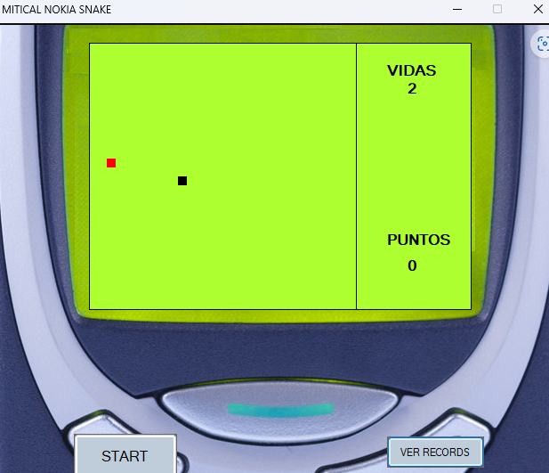

# 🐍 SnakeWF

Un clon del mítico juego **Snake** de los antiguos móviles Nokia, desarrollado con **Windows Forms en C#**. Este proyecto busca replicar fielmente la experiencia original, con la posibilidad de añadir mejoras en el futuro.

## 🖼️ Capturas de pantalla

A continuación se muestran algunas imágenes del juego en funcionamiento:

### 🟢 Pantalla principal


### 🐍 Juego en marcha


## 🎮 Controles

Los controles están asignados al **teclado numérico**:

- ⬆️ Arriba → `NumPad 8`
- ➡️ Derecha → `NumPad 6`
- ⬇️ Abajo → `NumPad 2`
- ⬅️ Izquierda → `NumPad 4`

> Asegúrate de tener activado el teclado numérico para jugar correctamente.

## 🛠️ Requisitos

- Visual Studio (recomendado 2019 o superior)
- .NET Framework 4.x
- Entity Framework 6.2.0 (incluido en el proyecto)

## 🚀 Cómo ejecutar

1.- Clona el repositorio:
   ```bash
   git clone https://github.com/antonicr1986/SnakeWF.git
2.- Abre el archivo SnakeWF.sln en Visual Studio.
3.- Restaura los paquetes NuGet si es necesario.
4.- Ejecuta el proyecto (F5) y ¡a jugar!

## 🗄️ Tabla de puntuaciones (opcional)

El juego funciona sin base de datos. La pantalla de records usa Entity Framework
contra un SQL Server, y esa parte necesita configuracion propia.

En `SnakeWF/`, copia `App.config.example` como `App.config` y sustituye los
valores `TU_SERVIDOR`, `TU_BASE_DE_DATOS`, `TU_USUARIO` y `TU_CONTRASENA` por
los de tu servidor.

`App.config` esta en el `.gitignore`: contiene credenciales y no debe subirse
al repositorio.

> El servidor online que usaba originalmente (somee.com) dejo de ofrecer plan
> gratuito, asi que esa base de datos ya no existe. Para probar la tabla de
> puntuaciones hay que apuntar a un SQL Server propio.

## 📦 Estructura del proyecto

SnakeWF/
├── SnakeWF.sln
├── SnakeWF/               # Código fuente principal
├── packages/              # Paquetes NuGet (incluye EntityFramework)
├── .vs/                   # Configuración de Visual Studio
└── readme.txt             # Instrucciones básicas de control

## ✨ Futuras mejoras

- Añadir niveles de dificultad
- Guardar puntuaciones
- Mejoras visuales y de sonido
- Compatibilidad con otros tipos de entrada
- Implementar modo multijugador local
- Añadir menú de inicio y pantalla de game over

## 📄 Licencia

Este proyecto se encuentra bajo una licencia abierta.  
Siéntete libre de usarlo, modificarlo y compartirlo con fines educativos o personales.  
Para usos comerciales, por favor contacta con el autor.
